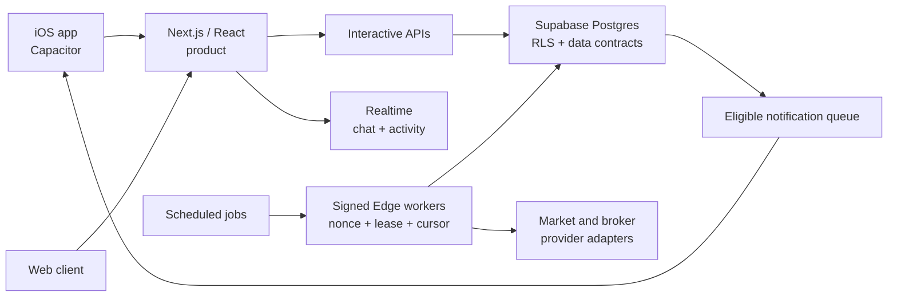

# InvestCircles

**A privacy-aware portfolio product for understanding investments and sharing selected context with trusted groups.**

InvestCircles brings portfolio tracking, transaction history, market context, and private discussion into one product. The case study focuses on a practical product question: how can people discuss investments without turning every balance, holding, or transaction into public information?

> **Status:** tested web product and iOS simulator build. The iOS application is not published in the App Store. The screenshots and video in this repository use a dedicated synthetic demo account; they do not show real users, balances, transactions, or private messages.

## Product walkthrough

  
  
  

**[Watch the iOS Simulator walkthrough](assets/investcircles-simulator-demo.mp4)**

## The problem

Broker applications record trades well, but often leave the user to connect transactions, portfolio changes, earnings, and market events on their own. Social investing products create a second problem: useful discussion can require context, while financial amounts and activity should remain private by default.

InvestCircles explores a middle ground:

- a consistent view of holdings, cash, transactions, and completed trades;
- market and earnings context connected to the portfolio;
- private friends and circles rather than an open performance feed;
- separate visibility controls for holdings, percentages, and monetary amounts;
- statement imports and read-only connection patterns;
- browser and iOS access to the same product.

## My contribution

I originated the concept and defined the product rules, user flows, data requirements, privacy boundaries, and release criteria. I then used AI coding tools extensively to implement and iterate the product across a Next.js/TypeScript web application, Supabase/PostgreSQL data layer, and Capacitor iOS shell.

My work included reviewing generated changes, testing edge cases, tracing failures across the interface and data layer, deciding what met the acceptance criteria, and documenting what remained unverified. The implementation was substantially AI-assisted; this case study does not imply that every line was written manually.

## Selected product decisions

1. **Privacy is a data-access rule, not a visual setting.** Visibility depends on the relationship between the portfolio owner and viewer; hiding a number in the interface is not treated as sufficient protection.
2. **Financial events need canonical identities.** Provider variations are normalized by symbol and fiscal period. Conflicting results are marked as disputed instead of triggering a confident explanation.
3. **No verified catalyst means no invented story.** Market-move explanations distinguish reported evidence from correlation and from cases where no cause has been confirmed.
4. **Background work must be bounded and repeatable.** Signed requests, replay protection, short leases, cursors, and idempotent writes reduce duplicate work and duplicate alerts.
5. **The first screen should not wait for everything.** Session, profile, theme, and a portfolio summary load together; secondary news, market, and social modules can refresh independently.

Read the fuller rationale in [Product decisions](docs/PRODUCT_DECISIONS.md).

## Technology

- Next.js 16, React 19, and TypeScript
- Supabase Postgres, Auth, Storage, Realtime, Cron, Vault, and Edge Functions
- Capacitor 8 and an iOS application shell
- GitHub Actions, Playwright, ESLint, and TypeScript checks
- provider adapters for broker statements, market data, and public financial events

The private source repository is intentionally not included. This public repository contains only the case study, synthetic media, architecture overview, and verification record.

## Dated engineering evidence

The most recent documented local verification was completed on **10 August 2026**:

| Check | Result | Scope |
| --- | ---: | --- |
| Automated TypeScript tests | 194/194 passed | Local test run |
| TypeScript and source lint | Passed | Local source checks |
| Next.js production build | 85 static pages generated | Local build with non-production values |
| Public browser journeys | 8/8 passed | Chromium and iPhone WebKit |
| iOS compilation | Debug and Release passed | Unsigned simulator builds |
| Dependency audit | 0 known vulnerabilities | `npm audit` at moderate severity or above |

These checks demonstrate the state of a dated build. They do **not** demonstrate production reliability, user adoption, revenue, retention, investment performance, or App Store availability. See [Evidence and limitations](docs/EVIDENCE.md).

## Architecture at a glance

## What is intentionally not claimed

- no real-money or investment-return result;
- no verified user, customer, revenue, or retention figure;
- no App Store publication;
- no claim that local tests prove production performance or security;
- no claim of fully manual authorship.

## Documentation

- [Product decisions](docs/PRODUCT_DECISIONS.md)
- [Evidence and limitations](docs/EVIDENCE.md)
- [Architecture and trust boundaries](docs/ARCHITECTURE.md)
- [AI-assisted development disclosure](docs/AI_ASSISTANCE.md)
- [Media provenance](docs/MEDIA.md)

---

Created by **Daniel Peña Hartwig** as a product-development and applied-AI portfolio project.
