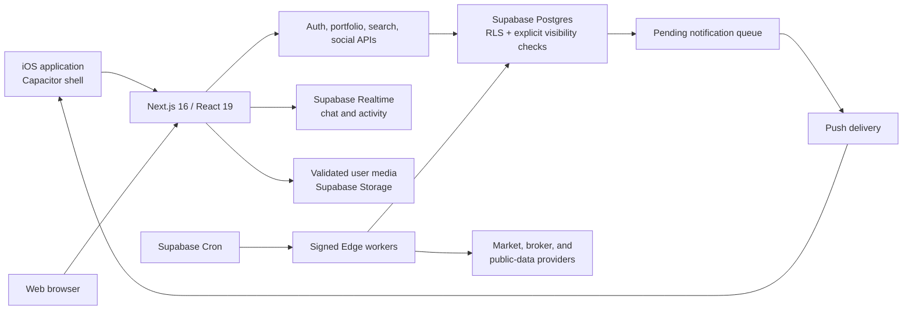

# Architecture and trust boundaries

## Product architecture

## Interactive request path

1. The server layout validates the authenticated session.
2. Profile preferences and a portfolio summary load into a shared bootstrap response.
3. The main shell can render before secondary market, news, and social modules finish refreshing.
4. Search requests are debounced and cancelled when superseded; only the latest response may update the interface.

## Market-data path

1. A scheduled job invokes a named worker with an HMAC signature, timestamp, and nonce.
2. The worker rejects stale or repeated requests and claims a short lease.
3. Provider data is normalized and written idempotently.
4. Detailed market snapshots use bounded retention; compact daily history is retained.
5. Earnings variants collapse into canonical symbol/fiscal-period events, while disputed actuals remain ineligible for alerts.
6. Eligible notifications enter a pending queue before push delivery.

## Trust boundaries

- Browser and native WebView clients are treated as untrusted.
- Row-level security and explicit relationship checks protect private data.
- Service-role access stays on server and Edge runtimes.
- Secrets are resolved from environment or Vault and are never included in this repository or its media.
- External URLs are validated before server-side fetching.
- Database changes, worker deployment, web deployment, and App Store distribution are separate approval gates.
